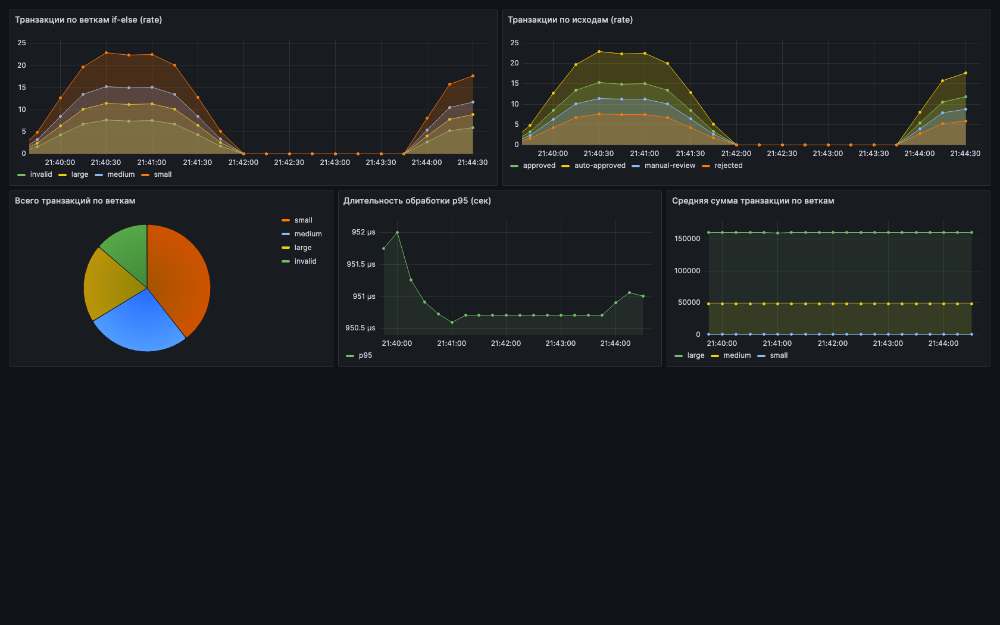
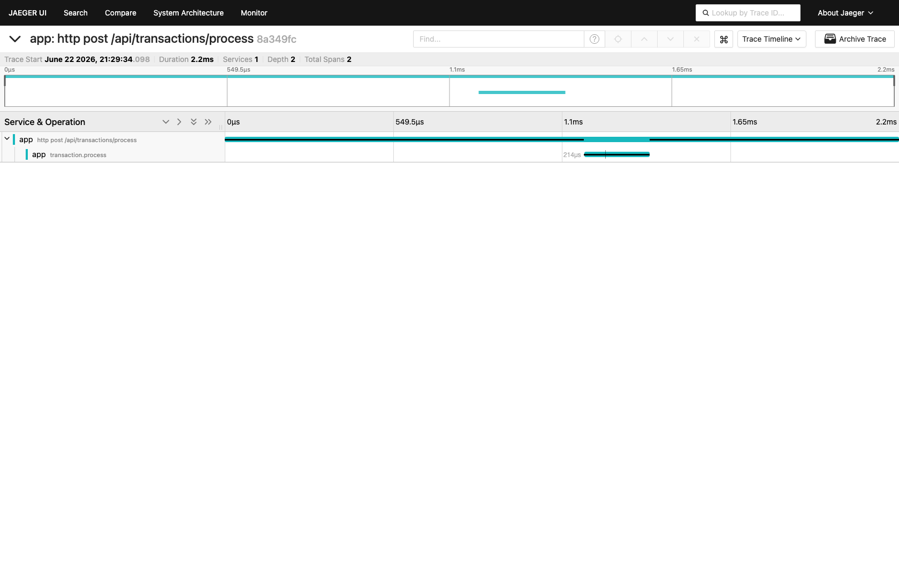
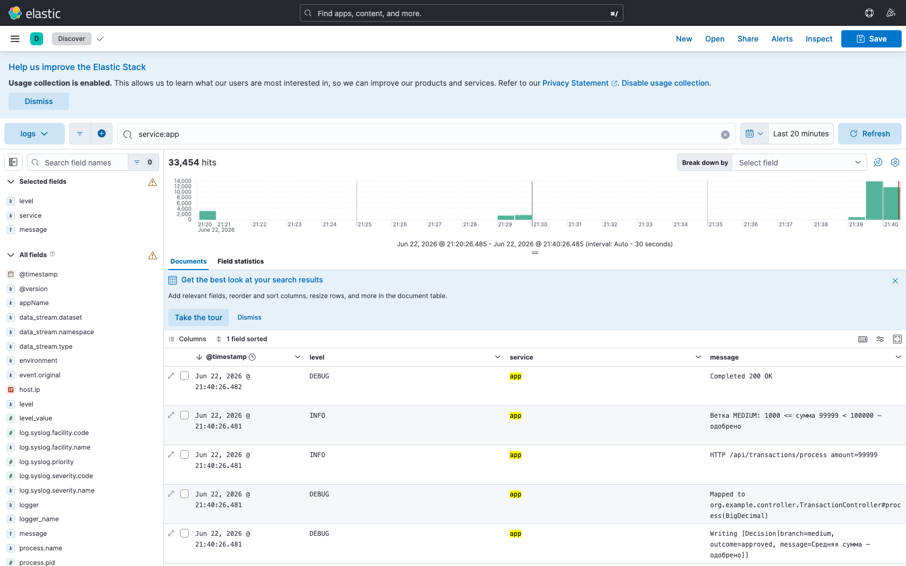

# Скриншоты observability

Сняты на запущенном стеке (`docker compose up -d` + `./generate-traffic.sh`).

## Grafana — Business if-else metrics

Транзакции по веткам и исходам (rate), доли веток (pie), p95 длительности, средняя сумма по веткам.

## Jaeger — трейс transaction.process

Span `transaction.process` с тегами `branch`/`outcome` и событиями `branch.*`.

## Kibana — логи по веткам if-else

Discover (data view `logs-*`, фильтр `service:app`) — JSON-логи приложения с `trace_id`.
